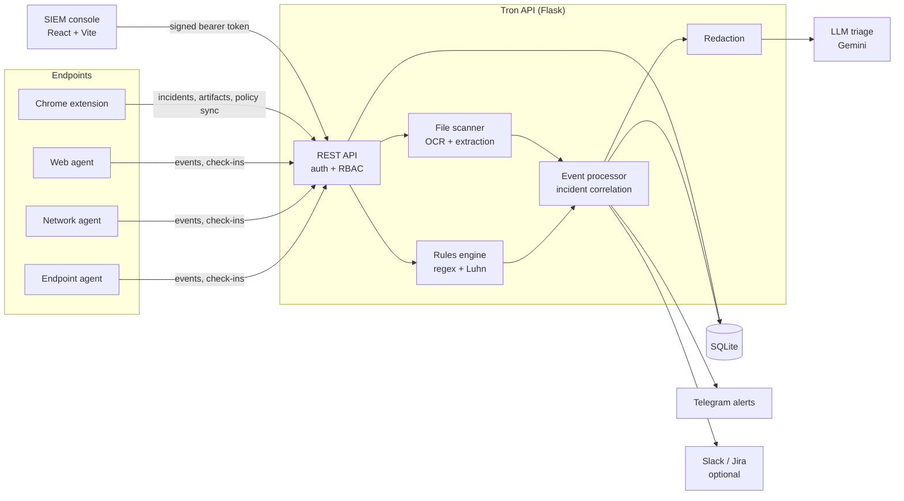

# Tron — the DLP Agent

Open-source endpoint and web data loss prevention: agents and a Chrome extension detect sensitive data leaving a machine, a Flask API scores and triages it, and a React console gives the SOC one place to investigate.

[](LICENSE)
[](https://www.python.org/)
[](https://react.dev/)

> **Status:** in progress. Built as a learning and portfolio project; not hardened for production use.

## What it does

**Endpoint agents** (`agents/`, Python, macOS/Linux)
- `endpoint_agent.py`: clipboard scanning, file-upload/watch-folder scanning, USB device detection, network connection and suspicious-process monitoring, shell and browser history scanning
- `network_agent.py`: outbound connections, outbound data volume, listening ports, browser activity
- `web_agent.py`: downloads, browser history, print spool and temp-file scanning

All agents check in to the API (fleet heartbeat) and post events to `/api/events`.

**Chrome extension** (`browser-extension/`, Manifest V3)
- Inspects web **pastes** and **file uploads** (file picker and drag-and-drop) before they reach the page
- Local regex scanning, with block / warn / monitor modes and policy sync from the API
- Reports incidents and blocked artifacts to the API

**SIEM console** (`siem-console/`, React + Vite)
- Dashboard with live event stream
- Fleet view (endpoint status, commands, collected artifacts)
- Policies and exceptions
- Governance (audit trail, users, roles and IAM settings)
- Analytics
- Events log with event and incident drill-down
- AI lab: generate a DLP rule from a natural-language prompt

## Detection pipeline

```
content ──► regex rules + Luhn check ──► text extraction / OCR ──► redaction ──► LLM triage ──► incident + alert
            (SSN, cards, keys, PII…)     (PDF, DOCX, XLSX, images)                (FP probability,
                                                                                    risk score, verdict)
```

1. **Pattern matching**: built-in regex rules (identity numbers, credit cards, cloud keys, tokens, secrets, contact data) plus policies created in the console. Card-like numbers are validated with the Luhn algorithm to cut false positives.
2. **Extraction and OCR**: PDF (PyPDF2, OCR fallback via pdf2image + Tesseract), DOCX, XLSX and images (Tesseract). Docling is used when installed for richer document extraction.
3. **Redaction**: before anything is sent to an external LLM, every pattern match and Luhn-valid card number is replaced with a typed placeholder such as `[REDACTED:SSN]`.
4. **LLM triage** (Gemini): returns a false-positive probability, risk score, verdict (`LIKELY_THREAT` / `LIKELY_FP` / `NEEDS_REVIEW`) and recommended action. Without an API key the system falls back to a neutral "needs review" result.
5. **Incidents and alerting**: events are correlated into incidents (threshold within a time window), stored in SQLite, pushed to the console, and alerted to Telegram (with inline actions). Slack and Jira escalation are optional.

## Architecture



## Quick start

### Option A: local (`setup.sh`)

```bash
git clone https://github.com/Kathan2004/Tron-the-DLP-Agent.git
cd Tron-the-DLP-Agent
./setup.sh                 # creates venv/, installs requirements, copies .env.example -> .env
$EDITOR .env               # fill in the variables below
./start                    # API on :5001 + console on :5173
# or
./start_all.sh             # API + endpoint, network and web agents
```

OCR needs system packages: `tesseract` and `poppler` (`brew install tesseract poppler` or `apt install tesseract-ocr poppler-utils`).

Open the console at http://localhost:5173. On first start, if `APP_ADMIN_PASSWORD` is not set, the API prints a one-time admin password and forces a change at first login.

### Option B: Docker Compose (API only)

```bash
cp .env.example .env && $EDITOR .env
mkdir -p config && cp /path/to/service-account.json config/service-account.json
docker compose up -d --build
curl http://localhost:5001/api/health
```

Run the console separately with `cd siem-console && npm install && npm run dev`.

### Environment variables

| Variable | Required | Description |
|---|---|---|
| `APP_AUTH_SECRET` | Recommended | Signs console auth tokens. If unset, a random per-run secret is used and sessions end on restart. |
| `APP_ADMIN_EMAIL` | No | Bootstrap admin email (default `admin@tron.local`). |
| `APP_ADMIN_PASSWORD` | No | Bootstrap admin password. If unset, a random one is generated, printed once, and must be changed on first login. |
| `APP_CORS_ORIGINS` | No | Comma-separated console origins allowed to call the API (default `http://localhost:5173,http://127.0.0.1:5173`). |
| `TELEGRAM_BOT_TOKEN` | Yes | Telegram bot token for alerts. |
| `SECURITY_CHAT_ID` | Yes (for alerts) | Telegram chat that receives alerts (`/getchatid` in the bot prints it). |
| `GCP_PROJECT_ID` | Yes | Google Cloud project ID. |
| `GCP_CREDENTIALS_PATH` | No | Service account key path (default `./config/service-account.json`). |
| `GOOGLE_GENAI_API_KEY` | No | Gemini API key for LLM triage and the AI rule lab. |
| `FLASK_HOST` / `FLASK_PORT` | No | API bind address (default `0.0.0.0:5000`; `.env.example` and the scripts use `127.0.0.1:5001`). |
| `SLACK_WEBHOOK_URL` | No | Slack escalation. |
| `JIRA_SERVER` / `JIRA_USER` / `JIRA_TOKEN` | No | Jira ticket creation on escalation. |
| `NGROK_DOMAIN` | No | `./start` only: expose the API through an ngrok reserved domain. |
| `VITE_API_BASE` | No | Console build-time API base URL (default `http://127.0.0.1:5001/api`). |

### Load the Chrome extension

1. Open `chrome://extensions` and enable **Developer mode**.
2. Click **Load unpacked** and select the `browser-extension/` folder.
3. The extension reports to `http://localhost:5001` by default (`apiUrl` in `browser-extension/background.js`).

## Security notes

- **Redaction before any external LLM call.** Server-side triage and rule generation pass all text through `redact_for_llm` (`src/file_scanner.py`); the extension masks regex matches in file text and findings before calling Gemini. Limitation: when the extension's optional AI mode is enabled with a Gemini key, **image** uploads are sent to Gemini unredacted for OCR.
- **Local storage keeps matched values.** Findings in the local SQLite database include the matched text so analysts can review them. Protect the `data/` directory accordingly.
- **Auth model.** Console users authenticate with email and password (PBKDF2-SHA256, 200k iterations). Successful login creates a server-side session and returns a signed, time-limited bearer token (`itsdangerous`, default TTL 8h). Every request re-checks the session: revocation, expiry, idle timeout (default 120 min), and a cap on concurrent sessions. Repeated failed logins lock the account. Roles: `SUPER_ADMIN`, `SECURITY_ADMIN`, `SOC_ANALYST`, `VIEWER`, with per-permission RBAC and custom roles. Accounts flagged for a password change can only use self-service auth endpoints until they change it.
- **CORS.** Console APIs only accept the origins in `APP_CORS_ORIGINS`. The unauthenticated ingest endpoints used by the extension's content script (`/api/browser/*`, `/api/scan/*`) accept any origin.
- **No real data is committed.** Databases, captured artifacts, logs, `.env` and service account keys are git-ignored. `.env.example` contains placeholders only.

## Screenshots

Screenshots will live in [`docs/screenshots/`](docs/screenshots/).

## Roadmap

- [ ] Production WSGI server and TLS guidance
- [ ] Agent authentication (per-agent keys) for ingest endpoints
- [ ] Windows endpoint agent
- [ ] Encrypted-at-rest findings and artifact retention policies
- [ ] Automated tests and CI
- [ ] Published extension build as a GitHub Release asset

## Project layout

```
agents/             endpoint, network and web agents
browser-extension/  Chrome MV3 extension
config/             settings (service-account.json goes here, git-ignored)
siem-console/       React/Vite admin console
src/                Flask API, rules engine, scanners, Telegram bot, database
main.py             API entry point
start / stop        API + console (+ optional ngrok)
start_all.sh / stop_all.sh   API + all agents
```

## Author

Kathan Somani

## License

[MIT](LICENSE)
