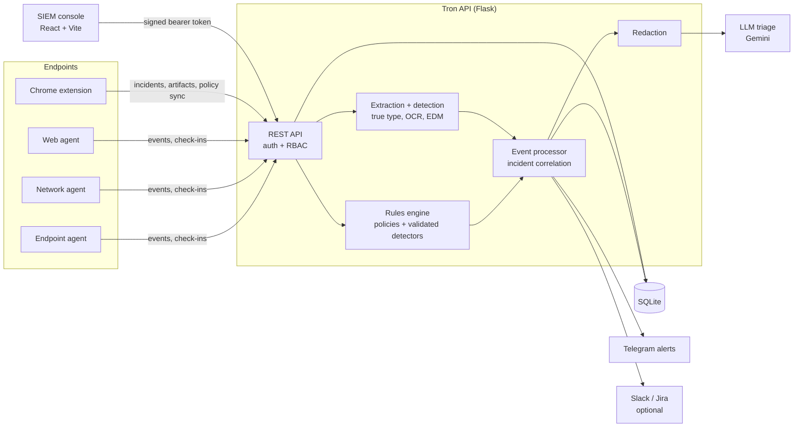

# Tron — the DLP Agent

Open-source endpoint and web data loss prevention: agents and a Chrome extension detect sensitive data leaving a machine, a Flask API scores and triages it, and a React console gives the SOC one place to investigate.

[](LICENSE)
[](https://www.python.org/)
[](https://react.dev/)

> **Status:** in progress. Built as a learning and portfolio project; not hardened for production use.

## What it does

**Endpoint agents** (`agents/`, Python, macOS/Linux)
- `endpoint_agent.py`: clipboard scanning, file-upload/watch-folder scanning, USB device detection, network connection and suspicious-process monitoring, shell and browser history scanning
- `network_agent.py`: outbound connections, outbound data volume, listening ports, browser activity
- `web_agent.py`: downloads, browser history, print spool and temp-file scanning

All agents check in to the API (fleet heartbeat) and post events to `/api/events`.

**Chrome extension** (`browser-extension/`, Manifest V3)
- Inspects web **pastes** and **file uploads** (file picker and drag-and-drop) before they reach the page
- Local regex scanning, with block / warn / monitor modes and policy sync from the API
- Reports incidents and blocked artifacts to the API

**SIEM console** (`siem-console/`, React + Vite)
- Dashboard with live event stream
- Fleet view (endpoint status, commands, collected artifacts)
- Policies and exceptions
- Governance (audit trail, users, roles and IAM settings)
- Analytics
- Events log with event and incident drill-down
- AI lab: generate a DLP rule from a natural-language prompt

## Detection pipeline

```
content ──► true file type ──► extraction / OCR ──► normalize ──► 47 detectors ──► validators ──► keyword context ──► EDM ──► redaction ──► LLM triage ──► incident + alert
            (magic bytes)      PDF, Office, ODF,     NFKC, strip    (PII, financial,  Luhn+IIN,      proximity                     before any     FP probability,
                               RTF, email, zip/tar,  zero-width,    secrets, health,  Verhoeff,      window                        external call  risk score
                               images (Tesseract)    base64 decode  classification)   mod-97, ...
```

1. **True type and extraction** (`src/extraction.py`): magic bytes pick the parser, so renamed files are still inspected. PDF text via PDFium, with page-level OCR only for scanned pages; Office/OpenDocument including headers, footers, comments, notes and numeric cells; archives and email attachments recursively with zip-bomb limits; encrypted files reported explicitly.
2. **Detection** (`src/detection/`): 47 data identifiers with checksum validators (Luhn + issuer ranges, Verhoeff, IBAN mod-97, SSN rules, ABA, GSTIN, JWT), keyword proximity, Unicode/zero-width/base64 evasion handling, and overlap resolution so one value yields one finding. 20 of them cover credentials (GitHub, GitLab, Slack, Stripe, Google, Azure, OpenAI, Anthropic, private keys, credentialed connection strings, entropy-checked generic secrets).
3. **Exact Data Match**: optional hashed index of protected records (for example the customer table); a match needs several fields of the same record, not just something that looks like an SSN.
4. **Policies**: console policies are either custom regexes or references to validated built-in detectors. Files with 10+ identity/financial findings escalate to critical (bulk exposure).
5. **Redaction and LLM triage** (Gemini): every detected value is replaced with `[REDACTED:<TYPE>]` before the prompt is built. The model returns a false-positive probability, risk score and verdict; without an API key the system falls back to "needs review".
6. **Incidents and alerting**: events are correlated per policy threshold and window, stored in SQLite, streamed to the console and sent to Telegram (with inline actions). Slack and Jira escalation are optional.

The browser extension runs the same detector library (generated from the Python source and parity-tested in CI).

**Measured against the previous version** (details and method in [docs/detection.md](docs/detection.md)):

| | Before | Now |
|---|---|---|
| False positives on 2.1 MB of unseen text (excluding emails) | 2,078 | 3 |
| Text scan, 1 MB | 528 ms | 177 ms |
| 10-page PDF extraction | 149 ms (Docling: 8 s warm) | 12 ms |
| Image OCR | 1.96 s | 0.14 s |
| Install size / peak memory with Docling | 6.3 GB / 2.4 GB | 83 MB / 44 MB |

## Architecture


```mermaid
flowchart LR
    subgraph Endpoints
        EA[Endpoint agent]
        NA[Network agent]
        WA[Web agent]
        EXT[Chrome extension]
    end

    subgraph Server["Tron API (Flask)"]
        API[REST API<br/>auth + RBAC]
        RE[Rules engine<br/>policies + validated detectors]
        FS[Extraction + detection<br/>true type, OCR, EDM]
        RED[Redaction]
        EP[Event processor<br/>incident correlation]
    end

    DB[(SQLite)]
    CON[SIEM console<br/>React + Vite]
    LLM[LLM triage<br/>Gemini]
    TG[Telegram alerts]
    ESC[Slack / Jira<br/>optional]

    EA & NA & WA -- events, check-ins --> API
    EXT -- incidents, artifacts, policy sync --> API
    API --> RE --> EP
    API --> FS --> EP
    EP --> DB
    EP --> RED --> LLM
    EP --> TG
    EP --> ESC
    CON -- signed bearer token --> API
    API --> DB
```

## Quick start

### Option A: local (`setup.sh`)

```bash
git clone https://github.com/Kathan2004/Tron-the-DLP-Agent.git
cd Tron-the-DLP-Agent
./setup.sh                 # creates venv/, installs requirements, copies .env.example -> .env
$EDITOR .env               # fill in the variables below
./start                    # API on :5001 + console on :5173
# or
./start_all.sh             # API + endpoint, network and web agents
```

OCR needs the Tesseract binary (`brew install tesseract` or `apt install tesseract-ocr`). Without it, images and scanned PDFs are reported as not inspected; everything else works.

Open the console at http://localhost:5173. On first start, if `APP_ADMIN_PASSWORD` is not set, the API prints a one-time admin password and forces a change at first login.

### Option B: Docker Compose (API only)

```bash
cp .env.example .env && $EDITOR .env
mkdir -p config && cp /path/to/service-account.json config/service-account.json
docker compose up -d --build
curl http://localhost:5001/api/health
```

Run the console separately with `cd siem-console && npm install && npm run dev`.

### Environment variables

| Variable | Required | Description |
|---|---|---|
| `APP_AUTH_SECRET` | Recommended | Signs console auth tokens. If unset, a random per-run secret is used and sessions end on restart. |
| `APP_ADMIN_EMAIL` | No | Bootstrap admin email (default `admin@tron.local`). |
| `APP_ADMIN_PASSWORD` | No | Bootstrap admin password. If unset, a random one is generated, printed once, and must be changed on first login. |
| `APP_CORS_ORIGINS` | No | Comma-separated console origins allowed to call the API (default `http://localhost:5173,http://127.0.0.1:5173`). |
| `TELEGRAM_BOT_TOKEN` | Yes | Telegram bot token for alerts. |
| `SECURITY_CHAT_ID` | Yes (for alerts) | Telegram chat that receives alerts (`/getchatid` in the bot prints it). |
| `GCP_PROJECT_ID` | Yes | Google Cloud project ID. |
| `GCP_CREDENTIALS_PATH` | No | Service account key path (default `./config/service-account.json`). |
| `GOOGLE_GENAI_API_KEY` | No | Gemini API key for LLM triage and the AI rule lab. |
| `FLASK_HOST` / `FLASK_PORT` | No | API bind address (default `0.0.0.0:5000`; `.env.example` and the scripts use `127.0.0.1:5001`). |
| `SLACK_WEBHOOK_URL` | No | Slack escalation. |
| `JIRA_SERVER` / `JIRA_USER` / `JIRA_TOKEN` | No | Jira ticket creation on escalation. |
| `NGROK_DOMAIN` | No | `./start` only: expose the API through an ngrok reserved domain. |
| `VITE_API_BASE` | No | Console build-time API base URL (default `http://127.0.0.1:5001/api`). |
| `APP_MAX_REQUEST_MB` | No | Maximum request body size (default 75 MB, enough for a base64-encoded 50 MB file). |
| `TRON_BULK_THRESHOLD` | No | Identity/financial findings in one file that escalate it to critical (default 10). |
| `TRON_EDM_DIR` / `TRON_EDM_KEY` | No | Exact Data Match index directory (default `data/edm`) and HMAC key (default: `data/edm/.key`, created on first build). |

### Load the Chrome extension

1. Open `chrome://extensions` and enable **Developer mode**.
2. Click **Load unpacked** and select the `browser-extension/` folder.
3. The extension reports to `http://localhost:5001` by default (`apiUrl` in `browser-extension/background.js`).

## Security notes

- **Redaction before any external LLM call.** Server-side triage and rule generation pass all text through `redact_for_llm`, which runs the full detector library with keyword requirements ignored (over-redaction is the safe failure); the extension masks detector matches in file text and findings before calling Gemini. Limitation: when the extension's optional AI mode is enabled with a Gemini key, **image** uploads are sent to Gemini unredacted for OCR.
- **Local storage keeps matched values.** Findings in the local SQLite database include the matched text so analysts can review them. Protect the `data/` directory accordingly.
- **Auth model.** Console users authenticate with email and password (PBKDF2-SHA256, 200k iterations). Successful login creates a server-side session and returns a signed, time-limited bearer token (`itsdangerous`, default TTL 8h). Every request re-checks the session: revocation, expiry, idle timeout (default 120 min), and a cap on concurrent sessions. Repeated failed logins lock the account. Roles: `SUPER_ADMIN`, `SECURITY_ADMIN`, `SOC_ANALYST`, `VIEWER`, with per-permission RBAC and custom roles. Accounts flagged for a password change can only use self-service auth endpoints until they change it.
- **Server-side scans require a session.** `/api/scan/file` (reads paths on the API host) and `/api/scan/clipboard` require console authentication; request bodies are capped by `APP_MAX_REQUEST_MB`.
- **CORS.** Console APIs only accept the origins in `APP_CORS_ORIGINS`. The unauthenticated ingest endpoints used by the extension's content script (`/api/browser/*`, `/api/scan/*`) accept any origin.
- **No real data is committed.** Databases, captured artifacts, logs, `.env` and service account keys are git-ignored. `.env.example` contains placeholders only.

## Tests

```bash
pip install -r requirements-dev.txt
python -m pytest -q                       # 62 tests; OCR tests skip if tesseract is missing
python scripts/benchmark_detection.py     # precision/recall + latency
```

CI (`.github/workflows/ci.yml`) runs the tests, the benchmark, the extension parity check, the console build and a manifest check on every push.

## Screenshots

Screenshots will live in [`docs/screenshots/`](docs/screenshots/).

## Roadmap

- [ ] Production WSGI server and TLS guidance
- [ ] Agent authentication (per-agent keys) for ingest endpoints
- [ ] Windows endpoint agent
- [ ] Encrypted-at-rest findings and artifact retention policies
- [ ] Indexed Document Matching (fingerprints of specific protected documents)
- [x] Validated detectors, keyword context, evasion handling, Exact Data Match
- [x] Lightweight extraction (Docling removed), archives, encrypted-file detection
- [x] Automated tests and CI
- [ ] Published extension build as a GitHub Release asset

## Project layout

```
agents/             endpoint, network and web agents
browser-extension/  Chrome MV3 extension
config/             settings (service-account.json goes here, git-ignored)
siem-console/       React/Vite admin console
src/                Flask API, rules engine, scanners, Telegram bot, database
src/detection/      detector library, validators, engine, Exact Data Match
src/extraction.py   true-type detection, PDF/Office/archive/email extraction, OCR
scripts/            benchmark, extension detector generator
tests/              pytest suite (detection, extraction, rules engine, API, extension parity)
docs/               detection design, benchmarks, gap analysis
main.py             API entry point
start / stop        API + console (+ optional ngrok)
start_all.sh / stop_all.sh   API + all agents
```

## Author

Kathan Somani

## License

[MIT](LICENSE)
